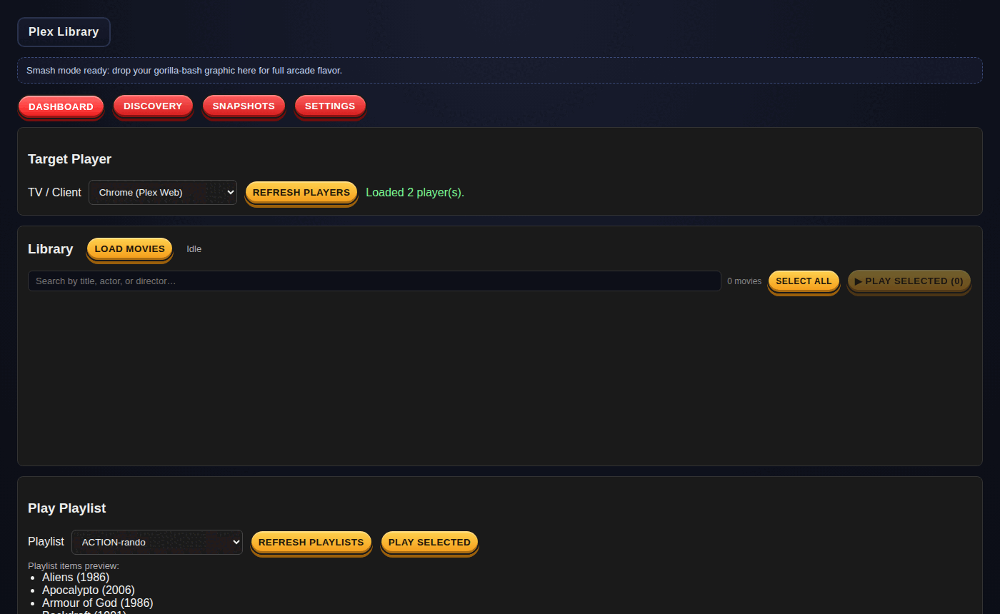

# Plex Dashboard

I kept running into out-of-memory crashes on the Plex app, so I wrote my own thing. The core idea is simple: stream movies directly to the LG webOS native player over the local network — no Plex client on the TV, no middleman app eating RAM.

It turned into something a bit bigger than that.



## What it does

**Plays movies on your LG TV** using the SSAP WebSocket protocol built into every modern LG webOS TV. Select one movie or build a multi-select playlist and push it straight over. The TV opens its own media player; Plex is just the file server.

**Generates random playlists** so you get the experience of your own always-on channel. It weights toward movies you've watched less, so you're not cycling through the same titles. Think of it as a personal shuffle that actually shuffles.

**Finds movies you're missing.** Search by actor, co-actor, director, or production studio (A24, Criterion, Pixar — whatever you're into) and see what's in their catalog that isn't in your library. If you have [Radarr](https://radarr.video) configured, you can add any missing title with one click.

**Tracks your library over time** with daily snapshots that diff against the previous day. It detects themes in newly added movies — recurring directors, actors, studios, genres, decades — and surfaces them in a patterns view. No snapshot is saved if nothing changed.

**Fast search across your whole library.** Title, actor, director, or studio — all rendered up front, no DOM rebuilding. Full-resolution poster art and a hover popup with plot, rating, runtime, and genres.

## What you'll need

- A **Plex** server with a movie library
- A **free [TMDB API account](https://www.themoviedb.org/settings/api)** — used for discovery, filmography lookups, and poster art
- An **LG Smart TV** on the same local network (for direct playback; everything else works without it)
- [Radarr](https://radarr.video) (optional, for one-click movie adds)
- Go 1.21+ to build from source, or grab a [pre-built binary](https://github.com/niski84/plex-dashboard/releases)

## Quick start

```bash
git clone https://github.com/niski84/plex-dashboard
cd plex-dashboard
cp .env.example .env   # fill in your values
go run ./cmd/plex-dashboard
# Open http://localhost:8081
```

All settings can also be saved through the Settings tab in the UI — no restart needed.

## Configuration

| Variable | Description |
|---|---|
| `PLEX_BASE_URL` | e.g. `http://192.168.1.10:32400` |
| `PLEX_TOKEN` | Your Plex auth token |
| `PLEX_LIBRARY_KEY` | Section key for your movie library (usually `1`) |
| `PLEX_TARGET_CLIENT_NAME` | Display name of your LG TV as seen in Plex |
| `TMDB_API_KEY` | TMDB API v3 key |
| `LGTV_ADDR` | LG TV local IP, e.g. `192.168.1.20` |
| `LGTV_CLIENT_KEY` | Pairing key obtained on first connection |
| `RADARR_URL` | e.g. `http://192.168.1.10:7878` |
| `RADARR_API_KEY` | Radarr API key |
| `PORT` | HTTP port (default `8081`) |

## Building a release binary

```bash
GOOS=linux GOARCH=amd64 go build -trimpath -ldflags="-s -w" -o plex-dashboard ./cmd/plex-dashboard
```

Pre-built binaries for Linux, macOS, and Windows are attached to every [GitHub Release](https://github.com/niski84/plex-dashboard/releases) via CI.

## How it's built

Go standard library backend, vanilla JS frontend, single binary. No web framework, no JavaScript framework, no database. Movie metadata is cached in memory and on disk so Plex takes as few hits as possible.

```
cmd/plex-dashboard/     — entry point
internal/plexdash/
  server.go             — HTTP routes, shared movie list cache (15-min TTL)
  plex_client.go        — Plex XML API
  discovery.go          — TMDB filmography and studio gap analysis
  lgssap.go             — LG webOS SSAP WebSocket client
  snapshots.go          — Daily library diff snapshots
  snapshot_patterns.go  — Theme detection (studios, directors, decades…)
web/plex-dashboard/
  index.html            — Single-page frontend
data/
  movie-snapshots/      — JSON snapshot history
  tmdb-discovery-cache/ — TMDB disk cache (7–180 day TTL per resource)
```

## Ideas and other TV support

If you want to add support for Roku, Fire TV, Apple TV, or anything else, open an issue and describe what you need. Pull requests are welcome. The LG integration lives in `lgssap.go` and is self-contained, so other targets should be straightforward to add alongside it.

## License

MIT
