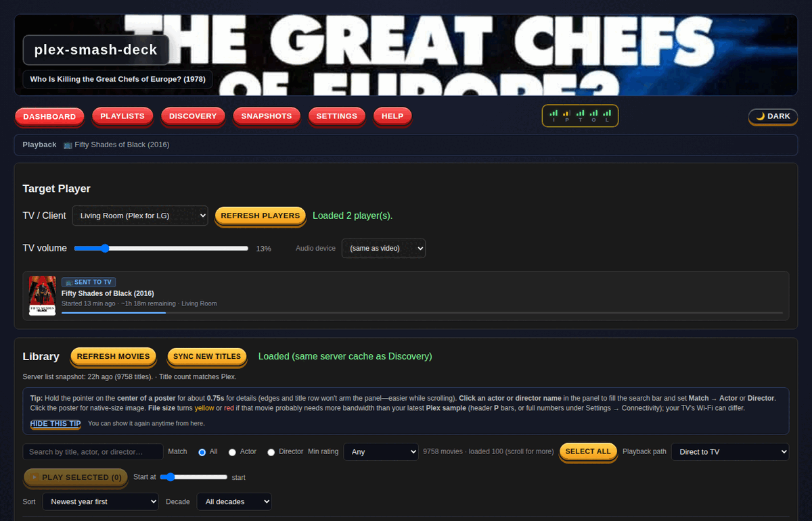

# Plex Smash Deck



A self-hosted Plex dashboard that streams movies directly to an LG webOS TV and layers discovery, playlists, library snapshots, and audio analysis on top. Bypasses the Plex TV app entirely — the TV's native player handles playback, Plex is just the file server.

Part of the [Smash Deck](https://github.com/niski84/smash-deck-catalog) family of self-hosted homelab dashboards.

## Features

**Playback**
- Push any movie or playlist to an LG TV over SSAP WebSocket
- Caption/subtitle track selection
- Playback history and resume position tracking
- Audio profile analysis per file

**Playlists**
- Weighted random playlists — titles you've watched less get more weight
- Playlists by person (actor/director), genre+rating, or pure random
- Preview before playing; play entire playlist in one click

**Discovery**
- Search TMDB by actor, co-actor, director, or production studio
- See which films are missing from your library vs. TMDB filmography
- One-click add to Radarr
- Fanart banner images for a cinema-quality header

**Library snapshots**
- Daily diffs — see exactly what was added since yesterday
- Pattern detection across new additions: recurring directors, studios, decades, genres
- Full in-memory search with poster art and blended TMDB/OMDb ratings

**Branding**
- Fanart.tv banner fetching and caching per movie/show

## Running

```bash
bash scripts/reload.sh
```

Or build manually:

```bash
go build -o plex-dashboard ./cmd/plex-dashboard && ./plex-dashboard
```

### Configuration

Copy `.env.example` to `.env` and fill in:

| Variable | Required | Description |
|----------|----------|-------------|
| `PLEX_BASE_URL` | yes | Plex server URL, e.g. `http://192.168.1.10:32400` |
| `PLEX_TOKEN` | yes | Plex auth token |
| `PLEX_LIBRARY_KEY` | yes | Library section key (default `1`) |
| `PLEX_TARGET_CLIENT_NAME` | yes | Plex player name to push to (e.g. `Living Room`) |
| `TMDB_API_KEY` | yes | TMDB API key (free) — needed for Discovery and posters |
| `PORT` | no | Listen port (default `8081`) |
| `LGTV_ADDR` | no | LG TV IP — enables direct SSAP playback push |
| `LGTV_CLIENT_KEY` | no | LG TV pairing key |
| `OMDB_API_KEY` | no | OMDb key — blends ratings with TMDB scores |
| `RADARR_URL` | no | Radarr base URL — enables one-click adds from Discovery |
| `RADARR_API_KEY` | no | Radarr API key |
| `FANART_API_KEY` | no | Fanart.tv key — enables cinematic banner art |

## Stack

- Go — single binary, no runtime dependencies
- `golang.org/x/crypto` — SSAP client key handling
- Embedded vanilla HTML/CSS/JS — no framework, no build step
- Playwright — end-to-end tests

## License

MIT
